 
## 查看主页获取源码

### 一、作品包含

源码+数据库+设计文档万字+PPT+全套环境和工具资源+部署教程

### 二、项目技术

前端技术：Html、Css、Js、Vue、Element-ui

数据库：MySQL

后端技术：Java、Spring Boot、MyBatis

  

### 三、运行环境

开发工具：IDEA/eclipse

数据库：MySQL5.7

数据库管理工具：Navicat10以上版本

环境配置软件： JDK1.8+Maven3.6.3

前端Nodejs：14

### 四、项目介绍
项目编号：springbootA193

护肤品推荐系统是在消费者对个性化护肤需求日益增长的背景下应运而生的一种智能服务。随着生活水平的提高和护肤意识的增强，消费者不再满足于通用的护肤方案，而是寻求更加贴合自己肤质和需求的个性化产品。，从而提高消费者的购物体验，同时也为护肤品企业提供了更加精准的市场定位和营销策略。

前台用户功能：浏览首页、商品信息、留言板、后台管理、购物车、个人中心。

后台分为管理员和用户
管理员的功能：系统首页、个人中心、用户管理、商品分类管理、商品信息管理、留言板、系统管理、订单管理。
用户的功能：系统首页、个人中心、我的收藏管理。

### 五、运行截图

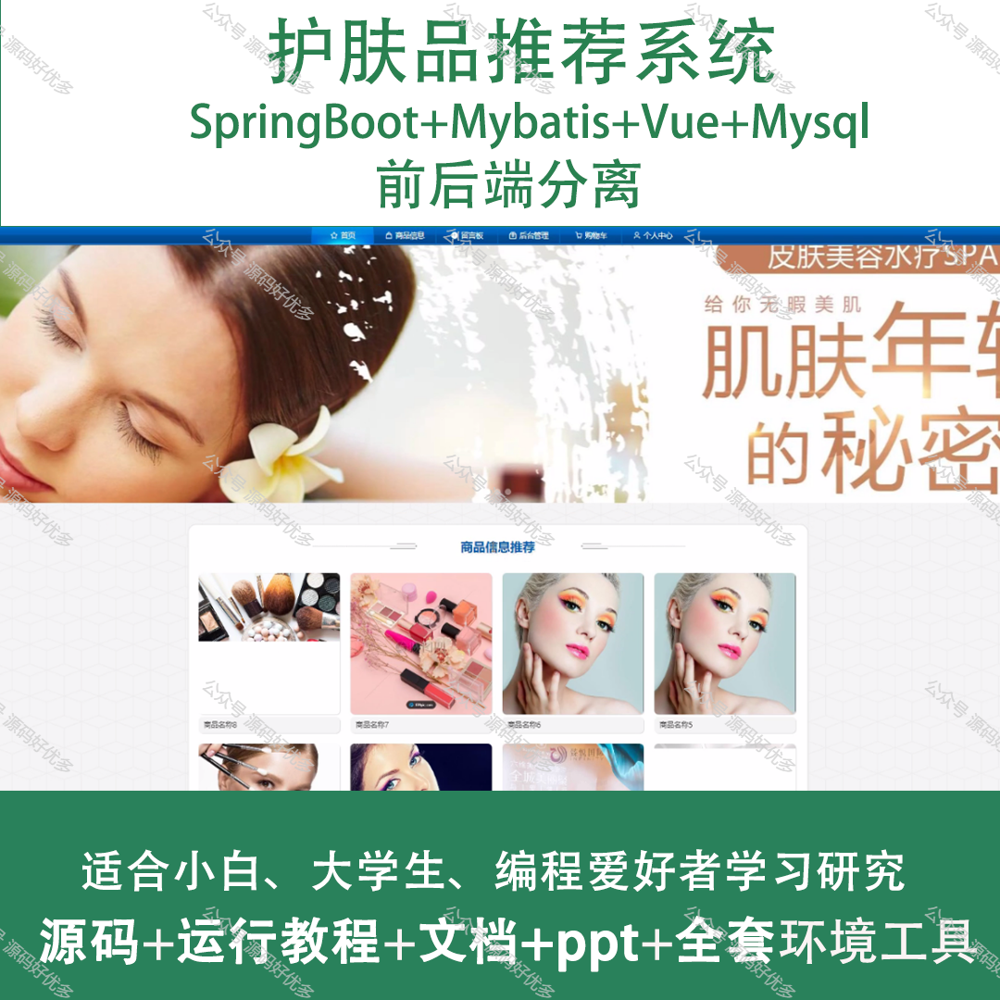
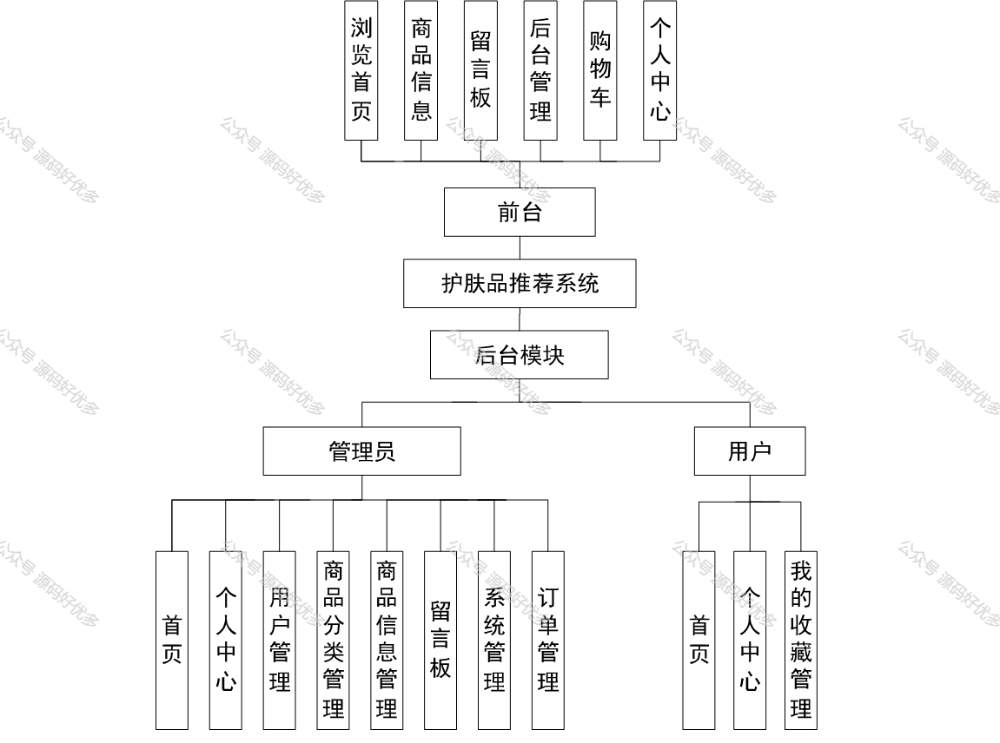
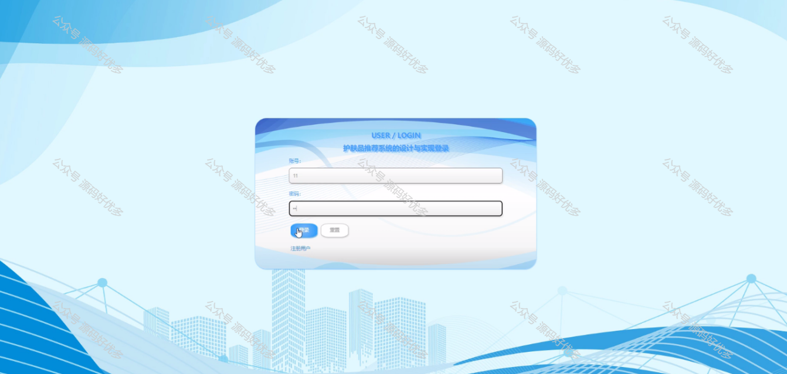
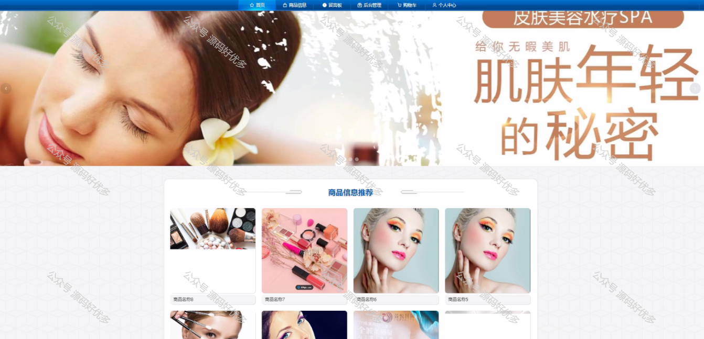
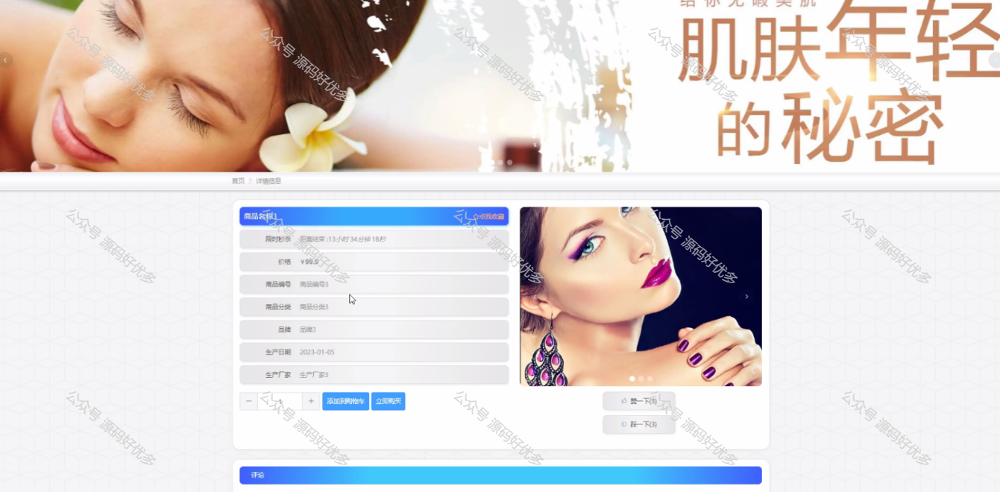
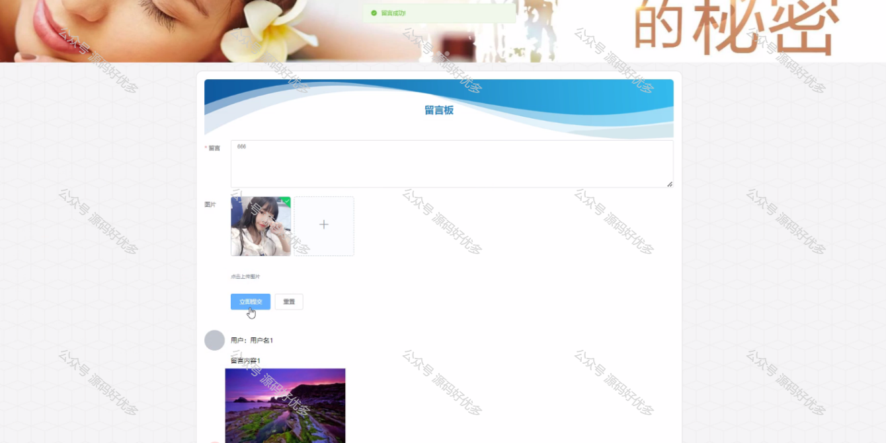
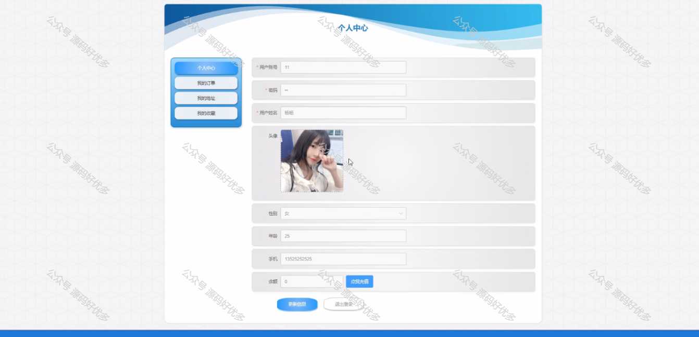
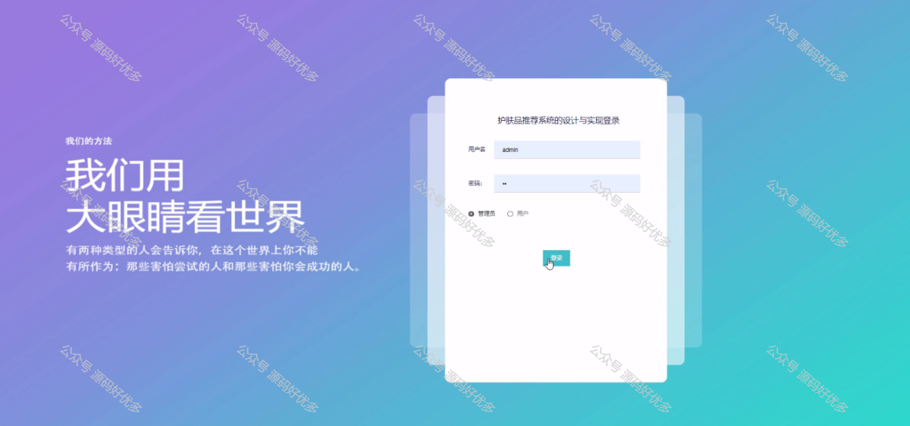
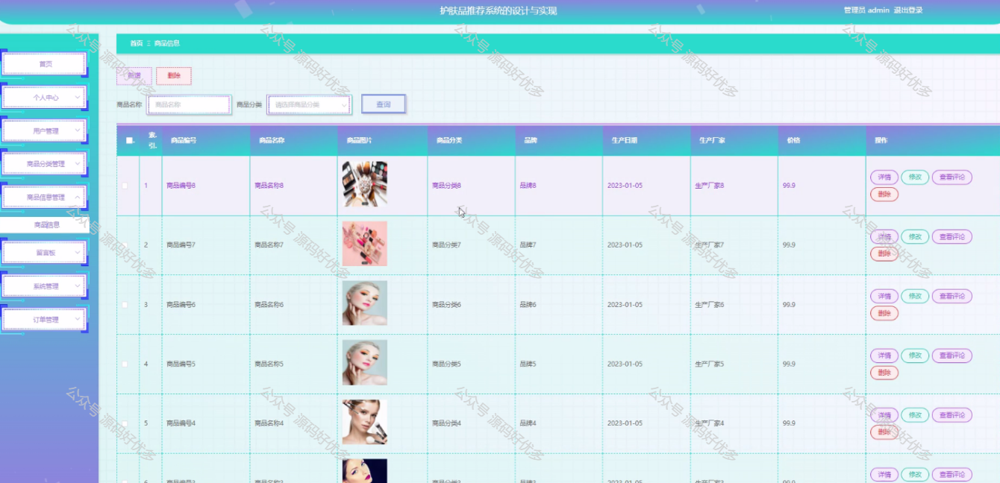
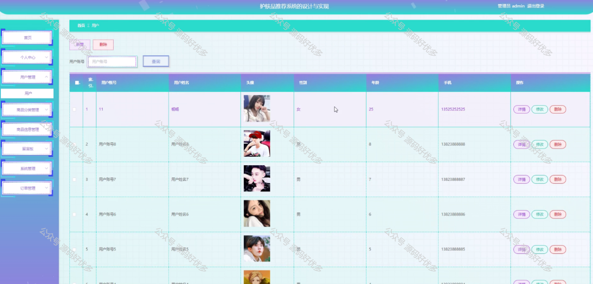
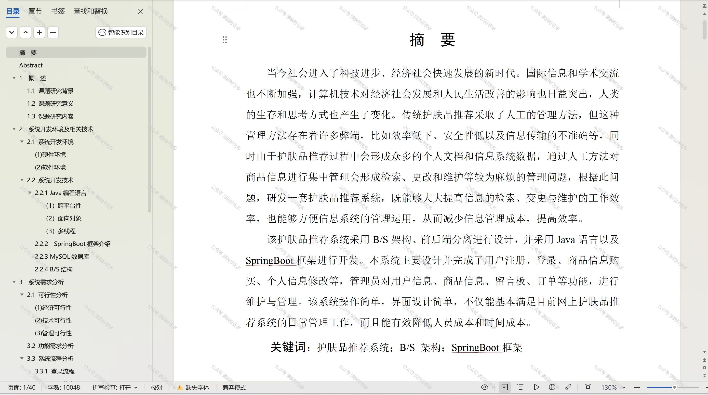

  
